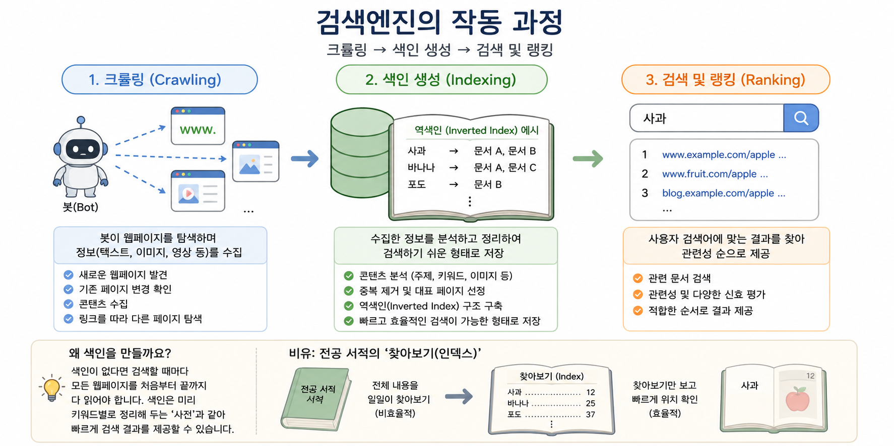
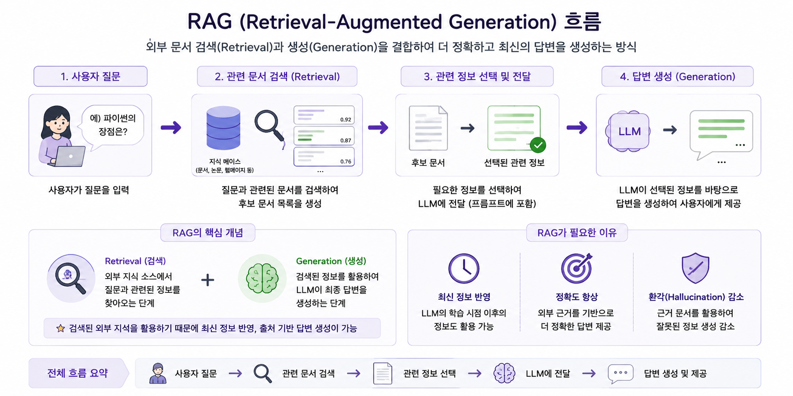
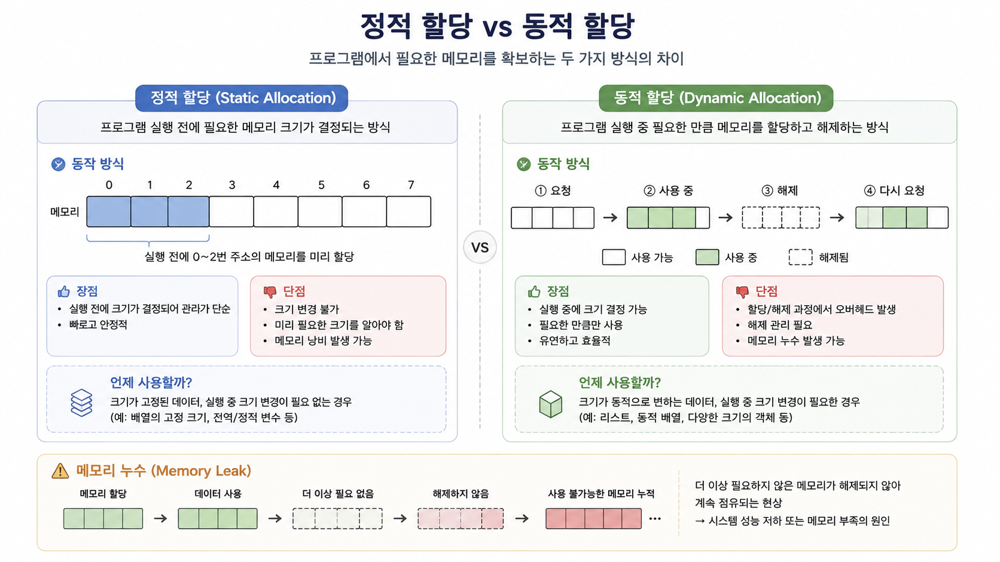

+++
date = '2026-08-16T18:06:51+09:00'
draft = false
title = 'Study Note 01'
+++

## 검색엔진의 작동 과정

검색엔진의 기본적인 처리 과정은 크롤링(Crawling) → 색인 생성(Indexing) → 검색 및 랭킹(Ranking)의 흐름

### 크롤링(Crawling)

검색엔진의 봇(Bot)이 웹페이지를 탐색하며 검색에 필요한 정보를 수집하는 과정

- 새로운 웹페이지 발견
- 기존 페이지의 변경 사항 확인
- 텍스트, 이미지 등의 콘텐츠 수집
- 페이지에 포함된 링크를 따라 다른 페이지 탐색

쉽게 말하면 검색에 사용할 수많은 책을 수집하는 단계

### 색인 생성(Indexing)

크롤링으로 수집한 정보를 분석하고 검색하기 쉬운 형태로 정리하여 저장하는 과정

검색할 때마다 모든 웹페이지를 처음부터 확인하는 것은 매우 비효율적인 방식  
따라서 검색엔진은 미리 페이지의 정보를 분석하여 검색에 적합한 구조로 저장

전공 서적 맨 뒤의 '찾아보기(Index)'와 비슷한 개념

#### 역색인(Inverted Index)

검색 시스템에서 사용되는 대표적인 자료구조

일반적인 문서 중심 구조

문서 A → 사과, 바나나  
문서 B → 사과, 포도  
문서 C → 바나나

이를 단어 중심으로 뒤집으면

사과 → 문서 A, 문서 B  
바나나 → 문서 A, 문서 C  
포도 → 문서 B

즉, 특정 단어가 어떤 문서에 등장하는지를 빠르게 찾을 수 있도록 만든 구조

### 검색 및 랭킹(Ranking)

사용자가 검색어를 입력하면 색인에서 관련 문서를 찾고 여러 신호를 바탕으로 검색 결과의 순서를 결정하는 과정

검색 결과는 단순히 특정 단어가 포함되어 있다는 이유만으로 결정되는 것이 아니라 검색어와의 관련성 등을 종합적으로 고려하여 결정

---

## 검색엔진과 AI의 연결

검색엔진에서 사용하는 수집 → 저장 및 검색 → 관련 정보 탐색의 개념은 현대 AI 시스템을 이해할 때도 중요한 기초 개념

### 크롤링과 AI 데이터

웹 크롤링은 AI와 데이터 분석에 필요한 데이터를 확보할 수 있는 방법 중 하나

AI 학습 데이터가 모두 크롤링으로 만들어지는 것은 아니며 공개 데이터셋, 라이선스 데이터, 직접 구축한 데이터 등 다양한 데이터 출처 존재

핵심은 AI 시스템 역시 데이터를 사용하기 위해 먼저 데이터를 확보하는 과정이 필요하다는 점

### 색인과 임베딩(Embedding)

전통적인 검색엔진의 색인과 AI의 임베딩은 동일한 기술은 아니지만, 정보를 검색하고 활용하기 좋은 형태로 표현한다는 점에서 연결되는 개념

임베딩(Embedding)
텍스트나 이미지 등의 정보를 컴퓨터가 계산할 수 있는 숫자 벡터(Vector)로 표현하는 방법

예시:

`강아지 → [0.21, -0.42, 0.73, ...]`

의미가 비슷한 데이터가 벡터 공간에서 가까운 위치에 있도록 표현할 수 있으며 이를 이용해 단순한 키워드 일치가 아닌 의미 기반 검색(Semantic Search) 가능

---

## RAG (Retrieval-Augmented Generation)

LLM에 외부 정보 검색을 결합하는 방식

사용자가 질문했을 때 관련 문서를 먼저 검색하고, 검색된 정보를 LLM에 제공한 뒤 이를 참고하여 답변을 생성하는 구조

### RAG가 필요한 이유

LLM은 학습 과정에서 습득한 정보만으로 모든 최신 정보나 특정 조직의 내부 정보를 알 수 없는 한계 존재

RAG를 활용하면 필요한 정보를 외부 데이터에서 검색하여 답변 생성에 활용 가능

예를 들어 회사 내부 문서를 대상으로 질문하는 AI 시스템이라면

사용자 질문 → 관련 사내 문서 검색 → 필요한 내용 선택 → LLM에 전달 → 답변 생성

의 흐름으로 구성 가능

RAG의 핵심은 검색(Retrieval)과 생성(Generation)의 결합

---

## CPU와 메모리

### CPU (Central Processing Unit)

컴퓨터에서 명령어를 해석하고 연산을 수행하며 프로그램의 실행을 제어하는 핵심 처리 장치

주요 역할

- 명령어 처리
- 산술 및 논리 연산
- 프로그램 실행 제어
- 다른 하드웨어와의 작업 조정

프로그램이 실행될 때 필요한 명령어와 데이터는 주로 주기억장치(RAM)에 적재되고 CPU가 이를 이용해 작업을 수행

---

## 정적 할당과 동적 할당

프로그램에서 데이터를 처리하기 위해 필요한 메모리를 확보하는 방식

### 정적 할당(Static Allocation)

필요한 메모리 크기가 실행 전에 결정되는 방식

미리 필요한 공간을 확보하기 때문에 관리가 단순하지만 필요한 크기를 사전에 알고 있어야 한다는 제약 존재

필요한 공간보다 크게 확보하면 사용하지 않는 메모리가 발생할 가능성

### 동적 할당(Dynamic Allocation)

프로그램 실행 중 필요한 크기의 메모리를 확보하여 사용하는 방식

필요한 만큼 메모리를 사용할 수 있어 유연하지만 할당과 해제에 대한 추가적인 관리 필요

동적으로 할당된 메모리를 더 이상 사용하지 않는데도 적절하게 해제하지 않을 경우 메모리 누수(Memory Leak) 발생 가능

※ 스택에 저장되는 지역 변수와 정적 메모리 할당은 엄밀하게는 같은 개념이 아니므로 구분 필요

---

## 데이터 파이프라인(Data Pipeline)

데이터가 여러 처리 단계를 거쳐 이동하도록 각 프로세스를 연결한 구조

대표적인 흐름

데이터 수집 → 데이터 변환 및 처리 → 저장 또는 전달 → 분석·서비스 활용

실제 데이터 파이프라인의 구성은 목적에 따라 달라질 수 있으며 각 단계를 자동화하여 반복적으로 실행하도록 구성 가능

### 데이터 파이프라인의 목적

- 반복적인 데이터 처리 자동화
- 여러 시스템 사이의 데이터 이동
- 데이터 처리 과정의 일관성 유지
- 분석 및 AI 시스템에 필요한 데이터 공급

---

## 마운트(Mount)

저장 장치나 외부 파일 시스템을 현재 시스템의 특정 경로에 연결하여 접근할 수 있도록 만드는 과정

### Google Colab과 Google Drive

Google Colab에서 Google Drive를 마운트하면 Drive에 있는 파일을 Colab의 파일 시스템 경로를 통해 접근 가능

Google Colab ↔ Mount ↔ Google Drive

쉽게 비유하면 기존 집과 새로운 방 사이에 출입문을 만드는 것과 비슷한 개념

- 마운트 전 → 장치나 저장 공간은 존재하지만 현재 파일 시스템 경로를 통한 접근이 연결되지 않은 상태
- 마운트 → 특정 경로와 외부 파일 시스템을 연결한 상태
- 언마운트(Unmount) → 연결을 안전하게 해제하는 과정

USB, 외장하드, 네트워크 저장소 등에서도 사용되는 기본적인 개념